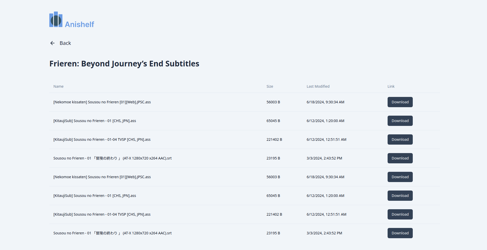

# anishelf

Anishelf is a full-stack web application that allows you to select any anime episode to grab subtitle files and generate flashcard decks for Japanese vocabulary to use in SRS programs.

## 🔎 Preview

## 👨‍💻 Technical Breakdown

Anishelf provides a catalogue of anime series for users which is retrieved from the [Anilist API](https://docs.anilist.co/). 

Once a particular episode is selected, Anishelf generates flashcard decks by analyzing the vocabulary found in the subtitle file for that episode. An episode's subtitle file can be found using the anime's Anilist ID and the [Jimaku API](https://jimaku.cc/api/docs). 

Anishelf then parses the subtitle file and segments the text into individual words using the [MeCab library](https://pypi.org/project/mecab-python3/). This is necessary since Japanese does not use spaces to separate words.

Once all words have been parsed from the subtitle file, Anishelf organizes the resulting vocabulary list by frequency. Anishelf then retrieves the vocabulary's definition from a PostgreSQL database which stores data parsed from [JMDict](https://www.edrdg.org/jmdict/j_jmdict.html). This data is used to create a .csv file which can be imported into Anki as a flashcard deck.

## 🎯 Roadmap
- Utilize the [AnkiConnect API](https://foosoft.net/projects/anki-connect/) to directly export cards from the application onto Anki
- Update card formatting to include example sentences, highlighted words, audio for word pronunciation, and pitch accent
- Add additional ways of sorting cards (e.g. by overall frequency among all Japanese words, chronological order in the episode, etc.)

## 🌐 Usage

You can try Anishelf yourself by visiting https://anishelf.tech/ to view the deployed website!

