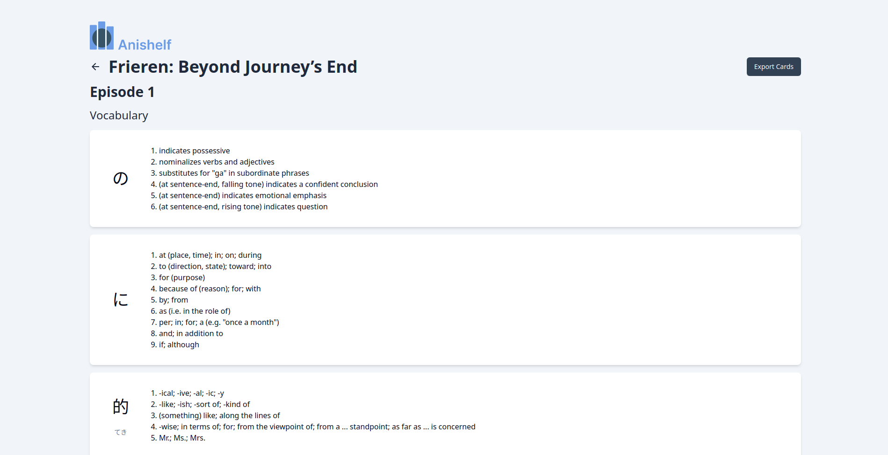

# anishelf

Anishelf is a full-stack web application that allows you to select any anime episode to grab subtitle files and generate flashcard decks for vocabulary to use in SRS programs. Anishelf was built using Next.js, Flask, and PostgreSQL. 

### Preview

## Usage

You can try Anishelf yourself by visiting https://anishelf.tech/ to view the deployed website!

